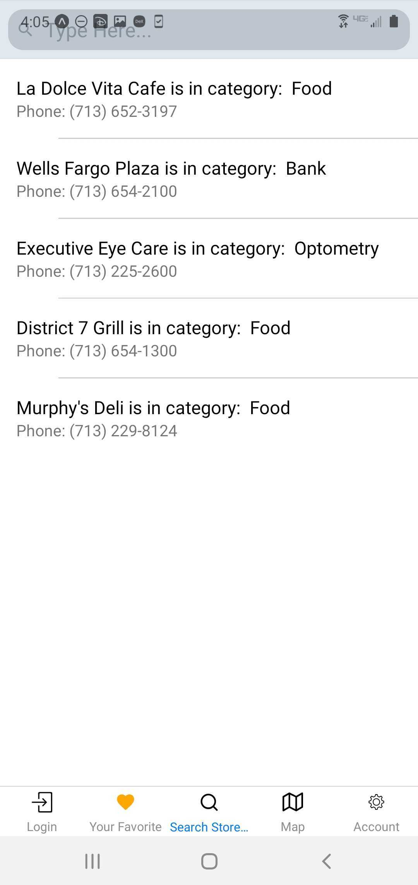

# OrangeLocator 
 
Downtown's "underground" is a system of tunnels 20 feet below Houston's downtown streets and more than 6 miles long. Having started years ago as a tunnel between two downtown movie theaters, today it includes restaurants and service retail and connects 95 city blocks. 
The main issue about tunnels is navigation. Mobile is not working there, public wi-fi is poorly provided. Normal mobile navigation is almost useless in tunnels, so it is easy to get lost there. 
**The purpose of our project** is to provide simple user-friendly offline navigation in Houston Downtown tunnels using custom QR-codes.

## How to use OrangeLocator
When the user first launches the app on the phone, it is necessary 
to sign up and sign in.  
 
 

The user opens the OrangeLocation app right before going down to the tunnels.  
The app shows the map of the tunnels. 
 

When user riches the first  QR code in tunnel, pushes the button "Update Location" on the map screen. The app opens QR-code scanner. User updates  current position. now it is marked with blue pin on the map 
 

Next user can choose the destination from the list by pushing the button "New Destination" 
 

Than the user can  go to the place, updating the location  by scanning the QR codes. 
User can also  save favorite locations  
 
 

## Technologies used
* React-Native
* Redux
* Expo
* MongoDB
* Mongoose
* Node.js
* Express
* Xcode

## App Video Demo
https://youtu.be/YEwupqOfkgs

## Authors
* [Richard Zhang](https://github.com/getrealzx)(https://rztexas.netlify.app/)
* [Diego Rivera](https://github.com/driver1213)(https://driver1213.github.io/)
* [Sean Page](https://github.com/PageSeanA)(http://seanapage.tech/)
* [Alina Belova](https://github.com/AlinaNBelova)(https://alinabelova.netlify.app)